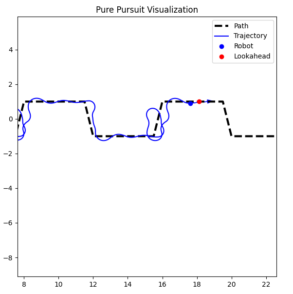
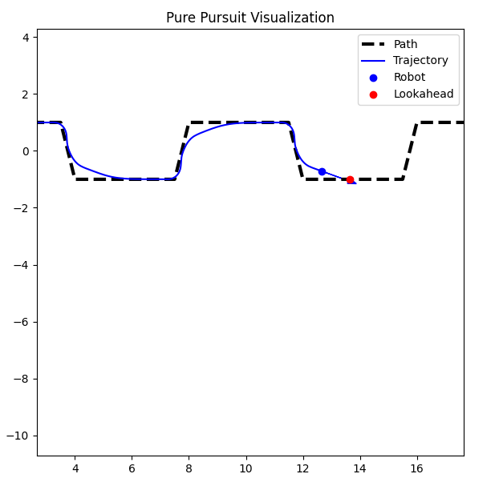

# Pure Pursuit ROS 2 Controller

This ROS 2 package implements a configurable **Pure Pursuit** controller for differential-drive robots.


## 🧩 Parameters

| Name              | Description                      | Default |
|-------------------|----------------------------------|---------|
| `lookahead_distance` | Distance to target point ahead    | `0.9`   |
| `wheelbase_length`   | Robot's wheelbase (m)            | `0.5`   |
| `max_linear_speed`   | Max forward speed (m/s)          | `0.5`   |

---

Smaller lookahead distance → more aggressive turning  
Larger lookahead distance → smoother but less accurate tracking

### 🔍 Lookahead = 0.4 m



### 🔍 Lookahead = 0.9 m



---

## 🚀 Launch

```bash
ros2 launch pure_pursuit_ros2 pure_pursuit.launch.py
```