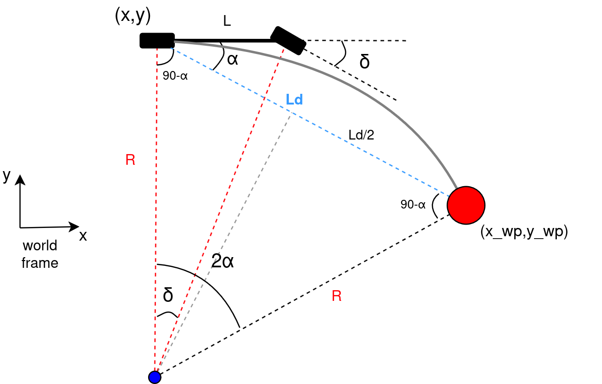

# Pure Pursuit ROS 2 Controller

This ROS 2 package implements a configurable **Pure Pursuit** controller for differential-drive robots.



## 🧩 Parameters

| Name              | Description                      | Default |
|-------------------|----------------------------------|---------|
| `lookahead_distance` | Distance to target point ahead    | `0.9`   |
| `wheelbase_length`   | Robot's wheelbase (m)            | `0.5`   |
| `max_linear_speed`   | Max forward speed (m/s)          | `0.5`   |
| `pose_topic` | Pose topic    | `/current_pose`   |
| `path_topic`   | Path topic           | `/waypoints`   |
| `cmd_vel_topic`   | Cmd_Vel topic          | `/cmd_vel`   |

1. **Robot Pose Extraction**:
   - The robot's current position and heading (yaw angle) are extracted:
     ```
     (x, y) — position
     θ (yaw) — extracted from quaternion using:
     θ = atan2(2(wz + xy), 1 - 2(y² + z²))
     ```

2. **Lookahead Point Selection**:
   - From the global path, the first waypoint at a distance greater than the lookahead distance `L_d` is selected:
     ```
     L_d = sqrt((x_wp - x)² + (y_wp - y)²)
     ```

3. **Heading Error (α)**:
   - The angle between the robot's heading and the direction to the lookahead point:
     ```
     α = atan2(y_wp - y, x_wp - x) - θ
     ```

4. **Curvature (κ)**:
   - If α ≈ 0, robot is aligned — curvature is zero.
   - Otherwise:
     ```
     R = L_d / (2 * sin(α))
     κ = 1 / R
     ```

5. **Steering Angle (δ)**:
   - Based on curvature and the vehicle's wheelbase `L`:
     ```
     δ = atan(κ * L)
     ```

6. **Velocity Commands**:
   - The controller publishes a velocity command:
     ```
     Linear velocity (v): constant (max_linear_speed)
     Angular velocity (ω): δ
     ```


---

## Study 1

> **Source:** *Pure Pursuit Path Tracking for Autonomous Vehicles*, Section 4.1  
>
> **4.1. Effects of Changing the Lookahead Distance**  
> There is one parameter in the pure pursuit algorithm, the lookahead distance. The effects of changing the lookahead distance must be considered within the context of one of two problems:  
>
> 1) Regaining a path; i.e. the vehicle is a “large” distance from the path and must attain the path.  
> 2) Maintaining the path, i.e. the vehicle is on the path and wants to remain on the path.  
>
> The effects of changing the parameter in the first problem are easy to imagine using the analogy to human driving. **Longer lookahead distances tend to converge to the path more gradually and with less oscillation**. The response of the pure pursuit tracker looks similar to the step response of a second order dynamic system (Figure 2.), and the value of L tends to act as a damping factor.

### 🔍 Lookahead = 0.4 m


### 🔍 Lookahead = 0.9 m


---

## 🚀 Launch

```bash
ros2 launch pure_pursuit_ros2 pure_pursuit.launch.py
```


## 📚 References

- Coulter, R. C. (1992). *Implementation of the Pure Pursuit Path Tracking Algorithm*. Carnegie Mellon University, Robotics Institute. [CMU-RI-TR-92-01](https://www.ri.cmu.edu/publications/implementation-of-the-pure-pursuit-path-tracking-algorithm/)
